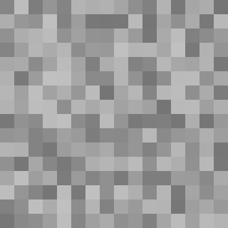
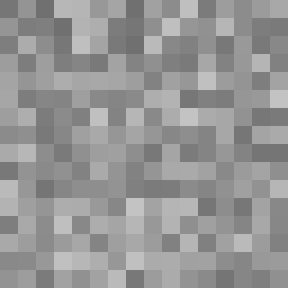

# Minecraft grass texture generator
Wide-customizable minecraft grass texture generator. Randomly choices colors from pallete to image. Has two pallete generation methods. Better method is minecraft pallete, he is more similar to minecraft grass texture. 

Pallete generation methods:
1. Simple gradient *(gradient)*: Generates gray gradient colors from 117 to 192.
2. Minecraft pallete *(pallete)*: Already specified pallete from minecraft gray grass colors. Almost as simple gradient pallete, but hasn't some colors.

## Dependencies
Requires: [**PyPNG**](https://pypi.org/project/pypng/ "See on PyPI"). Install with: `pip install pypng`.
## Usage
Starting without arguments creates image in folder, where you writed command. Random seed is selecting by python random. If you started program with random seed argument, all at same, but image generating with your random seed. All parameters (size, pallete method) you can change at top the code.

**Filename** is seed, numeration, pallete method. Example: `seed1234_3442_pallete.png`

**Program arguments**: random seed *(not required, type: integer)*.

Start without arguments:
```bash
python main.py
```

Start with random seed argument *(here random seed is **123**)*:
```bash
python main.py 123
```

Image generated with seed 1 and gradient method *(scaled)*:



Image generated with seed 1, but pallete method *(scaled)*:

